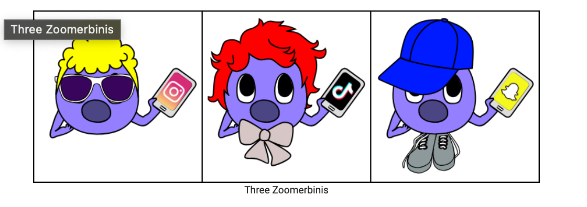
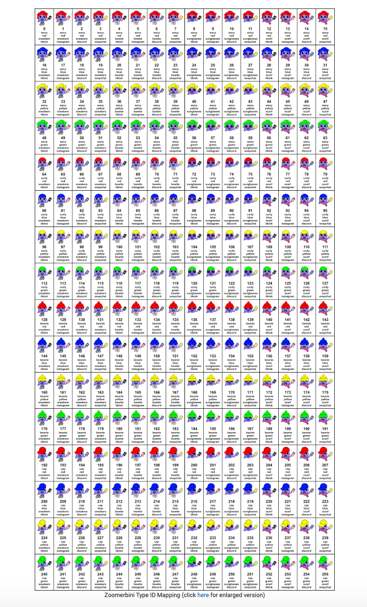
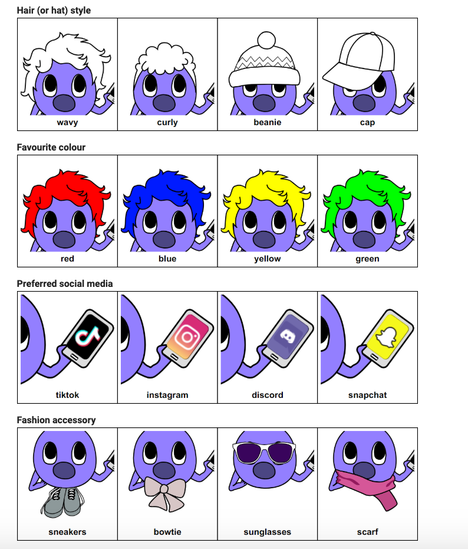

# Zoomerbinis-study-allocation

####_Background_
Zoomerbinis are mystical creatures known for their brilliant minds, particularly in solving logic puzzles. Like their forebearers, each one has a distinct combination of attributes that defines their style and unique character. Unfortunately, while brimming with potential, they're a bit of a shy bunch. They're struggling to form optimal study groups for their university subjects, and require a (would you guess it) Python programmer to come to their rescue!

Thankfully, the Zoomerbinis have your help and guidance. Your challenge in this project is to write some Python code to help them compute an optimal set of study groups, thus enabling them to reach their full potential!

 

###Zoomerbinis

There are 256 "types" of Zoomerbinis, each having a corresponding numeric identifier (a "type ID") represented as an integer between 0 and 255 inclusive. The figure below depicts the full mapping. You can also view an enlarged version of the same figure here.

click 
[here](https://2024s1-comp10001-d7ccc59f4734fd6399530ec2572d0fddd929b27d8ca441.pages.gitlab.unimelb.edu.au/) for enlarged and full version

If you study the mapping closely, you'll notice that it is far from random – there are certain attributes that different subsets of Zoomerbini types share, and these can be inferred from the type ID numbers themselves. Indeed, it is the unique combination of features that defines any one type.

Specifically, there are **four** attributes, each of which can take exactly one of four values to uniquely define a Zoomerbini type. First, each one will have a unique hair style or choice of hat. Second, each has a favourite colour (note that a Zoomerbini will always either dye their hair that colour or wear a hat of that same colour!). Third, each has a preferred social media platform. Finally, each has a "fashion accessory" for some extra flair!

Here are the possible values and corresponding visualisations for each attribute:

